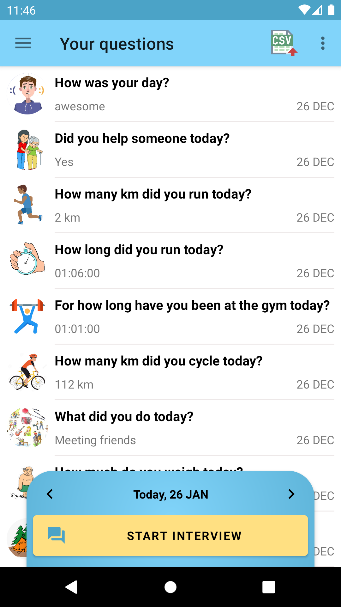
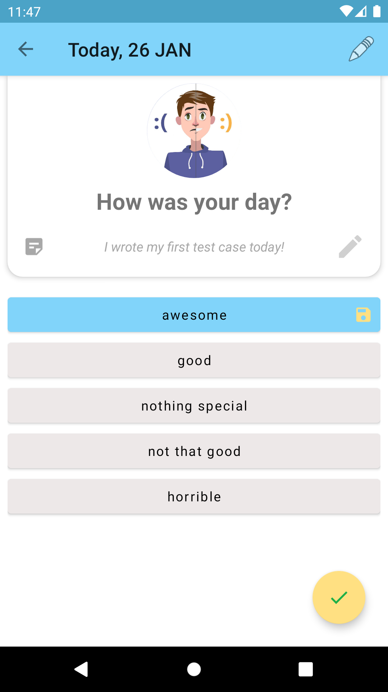
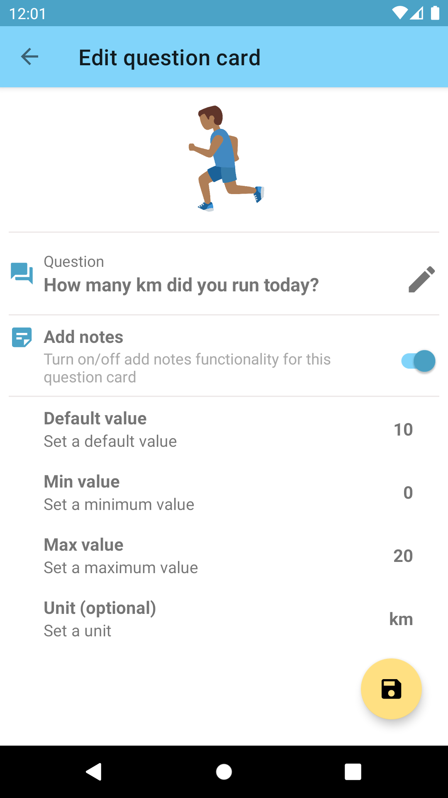

**Dear community,** 
 
**This is my first Android Project. The main purpose of doing this project is to learn Android and Software Development in general (!from scratch!).** 
 
However, the project has reached a stage by now, in which a fully functional application is available. So feel free to use it! 
 
The name of this application is **"Interview Diary"**: 
 
               
 
 
The idea of this app is to help you to find out more about yourself. In order to do that, you can create question cards with corresponding answer options and let the app ask you these questions on a regular basis (e.g. every day in the evening). Your answers will be recorded and can be recalled at any time. For a more detailed evaluation (e.g. with Excel) you can export the answer items as a CSV file. The results of your evaluation belong to you. You can decide how and if to make use of it. Unlike to other apps, this app does not store any data online. Everything is only stored on this device. It is about that you are coming to know yourself better and not that some big corporation does that for you. 
 
**The following features are already implemented:** 
 
-creating, editing and deleting question cards of three different types (numeric, time input, multiple choice with single and multi selection) 
-interview mode, in which the app "is asking" the questions 
-listview of all created answer items for each question card 
-CSV Sheet export (one sheet for each question card) 
 
**The following features can be implemented in the future:** 
 
-Backup functionality 
-Settings including manual language and theme change 
-Sorting functionality including something like "categories" 
-Simple evaluation funcionality like calculating average values and maybe pie chards etc. - but it won't be too sophisticated. The idea is that the user does the evaluation of the data on the computer with tools like Excel. 
-Implementation of a PIXABAY API for a more convenient image search 
 
**But with regard to the original purpose of this project, I will now focus on the topic "testing" first!** 
 
**Peace!** 
Jan
 
 
 
  
Creative Commons Lizenzvertrag 
Dieses Werk ist lizenziert unter einer Creative Commons Namensnennung-Nicht kommerziell 3.0 Deutschland Lizenz. 
 
 
